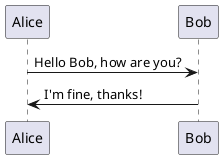

# PlantUML Editor

A modern web-based PlantUML diagram editor with real-time preview, built with React frontend and Java Spring Boot backend.

## 🌟 Features

- ✅ **Real-time Preview**: Instant diagram rendering as you type
- ✅ **Modern UI**: Clean, responsive React interface
- ✅ **Full PlantUML Support**: All diagram types (sequence, class, state, etc.)
- ✅ **Docker Ready**: Containerized for easy deployment
- ✅ **Hot Reload**: Development mode with live reloading
- ✅ **Export Options**: Save diagrams in various formats

## 🏗️ Architecture

```
┌─────────────────┐    HTTP/API    ┌──────────────────┐
│  React Frontend │◄──────────────►│ Java Spring Boot │
│   (Port 5173)   │                │   (Port 8090)    │
└─────────────────┘                └──────────────────┘
        │                                    │
        │                                    │
   ┌─────────┐                         ┌──────────┐
   │ Nginx   │                         │ PlantUML │
   │ Proxy   │                         │ Library  │
   └─────────┘                         └──────────┘
```

## 🚀 Quick Start

### Prerequisites
- **Docker & Docker Compose**
- **Java 11+** (for local builds)
- **Maven 3.6+**

### Start the Application

1. **Clone the repository**:
   ```bash
   git clone <repository-url>
   cd PlantUMLEditor
   ```

2. **Start with one command**:
   ```bash
   # Windows
   start.bat
   
   # Or manually
   docker-compose -f docker-compose.dev.yml up -d
   ```

3. **Access the application**:
   - 🌐 **Frontend**: http://localhost:5173
   - 🔧 **Backend API**: http://localhost:8090
   - 💊 **Health Check**: http://localhost:8090/api/plantuml/health

4. **Stop the application**:
   ```bash
   # Windows
   stop.bat
   
   # Or manually
   docker-compose -f docker-compose.dev.yml down
   ```

## 📁 Project Structure

```
PlantUMLEditor/
├── 📁 frontend/                    # React application
│   ├── 📁 src/                    # React source code
│   │   ├── components/            # React components
│   │   ├── services/              # API services
│   │   └── App.js                 # Main app component
│   ├── 🐳 Dockerfile              # Production build
│   ├── 🐳 Dockerfile.dev          # Development build
│   ├── ⚙️  nginx.conf             # Nginx configuration
│   └── 📦 package.json            # NPM dependencies
├── 📁 java-plantuml-server/       # Java Spring Boot backend
│   ├── 📁 src/main/java/          # Java source code
│   │   └── com/plantuml/server/   # Main application package
│   ├── 🐳 Dockerfile              # Production build
│   ├── 🐳 Dockerfile.dev          # Development build (pre-built JAR)
│   └── 📦 pom.xml                 # Maven dependencies
├── 🐳 docker-compose.yml          # Production environment
├── 🐳 docker-compose.dev.yml      # Development environment
├── 🚀 start.bat                   # Quick start script
├── 🛑 stop.bat                    # Stop script
└── 📖 README.md                   # This file
```

## 🔧 Development

### Option 1: Docker Development (Recommended)
```bash
# Start development environment
docker-compose -f docker-compose.dev.yml up -d

# View logs
docker-compose -f docker-compose.dev.yml logs -f

# Rebuild containers
docker-compose -f docker-compose.dev.yml build --no-cache
```

### Option 2: Manual Development Setup

1. **Start Java backend**:
   ```bash
   cd java-plantuml-server
   mvn clean package -DskipTests
   mvn spring-boot:run
   ```

2. **Start React frontend**:
   ```bash
   cd frontend
   npm install
   npm start
   ```

## 📝 Usage

### Basic Example
1. Open http://localhost:5173 in your browser
2. Enter PlantUML code in the left editor:



3. See the diagram appear instantly on the right!

### Supported Diagram Types

| Type | Example |
|------|---------|
| **Sequence** | `@startuml\nAlice -> Bob\n@enduml` |
| **Class** | `@startuml\nclass User\n@enduml` |
| **Use Case** | `@startuml\n(Start)\n@enduml` |
| **Activity** | `@startuml\n:Hello world;\n@enduml` |
| **State** | `@startuml\n[*] --> State1\n@enduml` |

## 🐳 Docker Configuration

### Development Environment
- **Frontend**: Hot reload enabled, source mounted as volume
- **Backend**: Pre-built JAR for faster startup
- **Networking**: Internal Docker network with health checks

### Production Environment
- **Frontend**: Optimized build with Nginx
- **Backend**: Minimal JRE image
- **Security**: Non-root user, resource limits

## 🛠️ API Endpoints

| Endpoint | Method | Description |
|----------|--------|-------------|
| `/api/plantuml/generate` | POST | Generate diagram from PlantUML code |
| `/api/plantuml/health` | GET | Health check endpoint |
| `/api/plantuml/png/{encoded}` | GET | Generate PNG from encoded PlantUML |
| `/api/plantuml/svg/{encoded}` | GET | Generate SVG from encoded PlantUML |

### Example API Usage
```bash
# Health check
curl http://localhost:8090/api/plantuml/health

# Generate diagram
curl -X POST http://localhost:8090/api/plantuml/generate \
  -H "Content-Type: application/json" \
  -d '{"code": "@startuml\nAlice -> Bob\n@enduml", "format": "png"}'
```

## 🔍 Troubleshooting

### Container Issues
```bash
# Check container status
docker-compose -f docker-compose.dev.yml ps

# View container logs
docker-compose -f docker-compose.dev.yml logs java-server-dev
docker-compose -f docker-compose.dev.yml logs frontend-dev

# Restart specific service
docker-compose -f docker-compose.dev.yml restart java-server-dev
```

### Port Conflicts
If ports 5173 or 8090 are already in use:
```bash
# Check what's using the port
netstat -ano | findstr :5173
netstat -ano | findstr :8090

# Kill the process or change ports in docker-compose.dev.yml
```

### Build Issues
```bash
# Clean rebuild
docker-compose -f docker-compose.dev.yml down
docker system prune -f
cd java-plantuml-server
mvn clean package -DskipTests
cd ..
docker-compose -f docker-compose.dev.yml up --build -d
```

### Common Issues

| Problem | Solution |
|---------|----------|
| Frontend not loading | Check if port 5173 is available |
| Backend API errors | Verify Java server is healthy |
| Docker build fails | Run `mvn clean package` first |
| Hot reload not working | Restart frontend container |

## 🚀 Deployment

### Production Deployment
```bash
# Build and start production environment
docker-compose up -d

# Access via http://localhost:80
```

### Environment Variables
Create `.env` file for customization:
```env
# Port configuration
FRONTEND_PORT=5173
BACKEND_PORT=8090

# Java configuration
JAVA_OPTS=-Xmx1g -Xms512m

# Spring profile
SPRING_PROFILES_ACTIVE=prod
```

## 🤝 Contributing

1. Fork the repository
2. Create a feature branch (`git checkout -b feature/amazing-feature`)
3. Commit your changes (`git commit -m 'Add amazing feature'`)
4. Push to the branch (`git push origin feature/amazing-feature`)
5. Open a Pull Request

## 📄 License

This project is licensed under the MIT License - see the [LICENSE](LICENSE) file for details.

## 🎯 What's Next?

- [ ] Add user authentication
- [ ] Implement diagram sharing
- [ ] Support more export formats
- [ ] Add diagram templates
- [ ] Real-time collaboration

---

**Happy diagramming! 🎨**