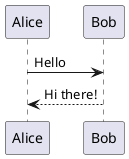
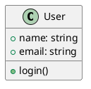
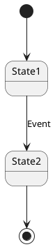
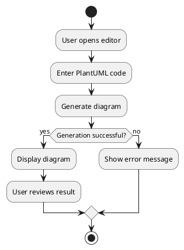
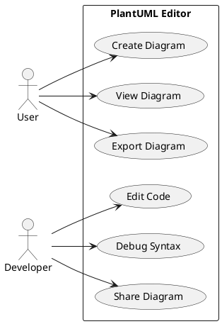
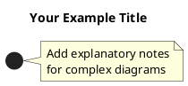

# PlantUML Examples

This directory contains example PlantUML diagrams that demonstrate the capabilities of the PlantUML Editor.

## 📁 Available Examples

### 🔄 Sequence Diagrams
- **File**: `sequence-diagram.puml`
- **Description**: Shows the interaction flow between User, Frontend, Backend, and PlantUML Library
- **Use Case**: API workflow documentation, system interactions

### 🏗️ Class Diagrams  
- **File**: `class-diagram.puml`
- **Description**: Represents the class structure of the PlantUML Editor application
- **Use Case**: Software architecture documentation, code structure

### 🎯 State Diagrams
- **File**: `state-diagram.puml`
- **Description**: Illustrates the different states of the application lifecycle
- **Use Case**: Application flow documentation, state management

## 🚀 How to Use

### In the Application
1. Start the PlantUML Editor: `./start.bat`
2. Open http://localhost:5173
3. Copy content from any `.puml` file
4. Paste into the editor
5. See the diagram render instantly!

### Direct Testing
```bash
# Test with curl
curl -X POST http://localhost:8090/api/plantuml/generate \
  -H "Content-Type: application/json" \
  -d @examples/sequence-diagram.json
```

## 📋 Example Templates

### Basic Sequence


### Simple Class


### Basic State


### Activity Diagram


### Use Case Diagram


## 🎨 Styling Examples

### Custom Colors
```plantuml
@startuml
!theme blue
skinparam backgroundColor #FFFFFE
skinparam actor {
  BackgroundColor #E1F5FE
  BorderColor #0277BD
}
@enduml
```

### Custom Fonts
```plantuml
@startuml
skinparam defaultFontName Arial
skinparam defaultFontSize 12
skinparam classFontSize 10
@enduml
```

## 📚 Learning Resources

- [PlantUML Official Guide](https://plantuml.com/guide)
- [PlantUML Cheat Sheet](https://ogom.github.io/draw_uml/plantuml/)
- [Diagram Types Reference](https://plantuml.com/sitemap-language-specification)

## 🤝 Contributing Examples

To add new examples:

1. Create a new `.puml` file in this directory
2. Add description to this README
3. Test the example in the application
4. Submit a Pull Request

### Example Format


---

Happy diagramming! 🎨
